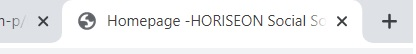
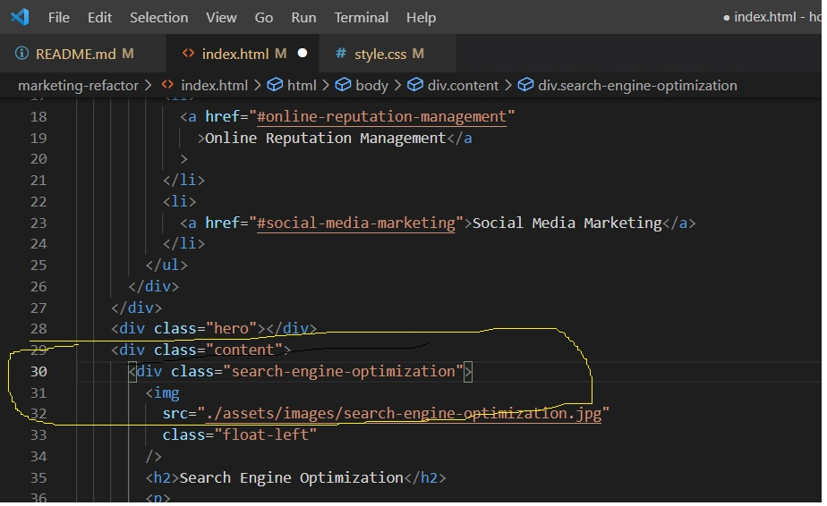
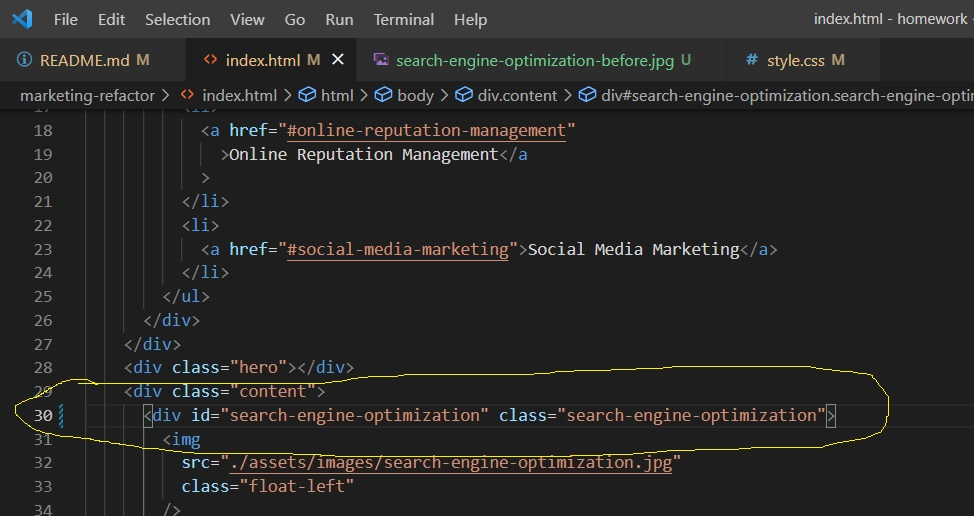

# marketing-refactor

# Updating Marketing Refactor Code

Below is a list of all the changes

### 1 - Changed the webpage title to include company name

Changed the title code to alow webpage tab title to include company name. This allows visitors to know which tab is the marketing agency.

### 2 - Changed code to allow "Search Engine Optimization" button to work.

The original code was incorrect (below)

The above code was missing the id element, which stopped the "Search Engine Optimization" button from working. I have added this code which allows the button to now operate (fixed code below)

If user now presses Social Engine Optimization on top of page this leads him to Social Engine Optimization on the page.

### 3 - Adding ALT attributes to images

Looking through the code you can see there are no "alt" attributes to the images on the webpage. I have gone through each image and added an alt attribute. This can make it clear to users the purpose of the image.

### 4 - Changed tags to include more semantic HTML attributes

I have replaced a few div tags with more semantic HTML attributes. I have also included the header, main, body and footer of the webpages lie and have put a description of this on the code. I have also included different sections which can help differentiate the different segments on the webpage.

### 5 - Removed duplicate class names in CSS stylesheet

There was a few class names which were duplicated, therefore I removed these and replaced them with a single class name, making stylesheet look more cleaner.

### 6 - Gave code a logical order

Code was not in logical order, which has now been changed to make it logical order.

### 7 - GitHub Link

https://github.com/qkhn95/marketing-refactor
